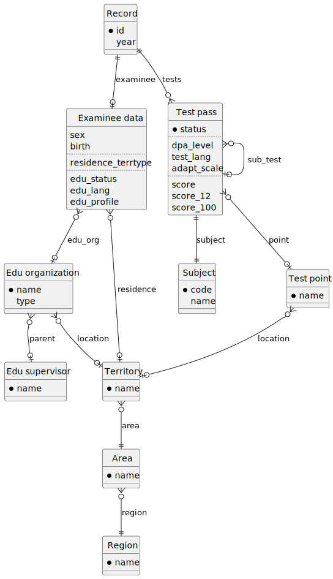
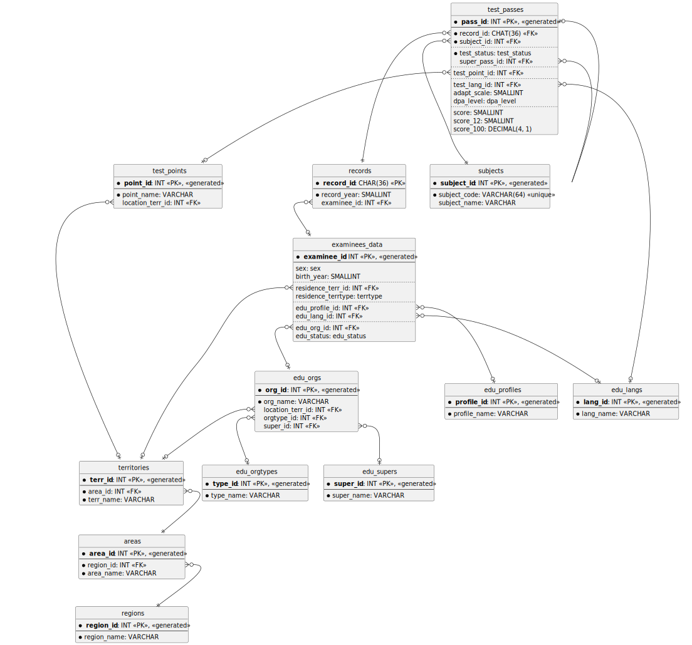

# #DataBase Labs
**Laboratory works for the Data Base course**  
**By:** *Oleh Rutov, FAM, KM-03*


## Laboratories data source

According to the laboratories task, *ZNO results open data datasets* 
were taken as the data source for the current laboratories.

In the current laboratories, I will concentrate on handling datasets 
with ZNO results for the next years:
* 2019
* 2020
* 2021

All datasets and legends for them can be downloaded from the official 
[*UCEQA website*](https://zno.testportal.com.ua/opendata).


## (Normalized, V2) Data model & database diagrams

### Logical (entities) diagram



### Physical (database) diagram




## Compose profiles & startup instructions

### Initial build

Before running services, you need to build docker-compose.
It can be done using the next command:

```bach
docker-compose build --no-cache
```

### Database deployment

To startup the dedicated database service (for something), 
you can execute the next command:

```bach
docker-compose up -d database
```

### Profiles guide

To be maximally suitable for all purposes, [`docker-compose.yaml`](docker-compose.yaml)
for the current work includes several different profiles.

#### Maintenance profiles

- ##### V1.1 (*#lab-1 #primary*) schema

  * ###### V1.1__init-db

    Runs `database` service and `maintenance__v1.1__init-db` service,
    provides the __V1.1__ (*#lab-1 #primary*) database schema initialization  
    (will not have an effect if tables already exist)
    
    &nbsp;
  
    > **Warning**
    > 
    > It is not recommended to initialize a clear database using this option,
    > because it will not create Flyway schema history table.  
    > 
    > Use the corresponding [Flyway migrate profile](#flyway-profiles) instead.

    &nbsp;

    Startup command example:
  
    ```bach
    docker-compose --profile V1.1__init-db up -d --force-recreate
    ```

  * ###### V1.1__inject__test-data

    Runs `database` service and `maintenance__v1.1__inject__test-data` service, 
    provides test ZNO OData injection as configured by 
    [`inject-reduced-2019-k100.yaml`](.work/zno-odata-injections/inject-reduced-2019-k100.yaml)
    into the database, which schema corresponds to the __V1.1__ (*#lab-1 #primary*).
  
    &nbsp;

    Startup command example:
  
    ```bach
    docker-compose --profile V1.1__inject__test-data up -d --force-recreate
    ```

  * ###### V1.1__inject__work-data

    Runs `database` service and `maintenance__v1.1__inject__work-data` service, 
    provides full ZNO OData for years __2020__ / __2021__ injection as configured by 
    [`inject-2020-2021.yaml`](.work/zno-odata-injections/inject-2020-2021.yaml)
    into the database, which schema corresponds to the __V1.1__ (*#lab-1 #primary*).
  
    &nbsp;

    Startup command example:
  
    ```bach
    docker-compose --profile V1.1__inject__work-data up -d --force-recreate
    ```

- ##### V2.1 (*#lab-2 #primary*) schema

  * ###### V2.1__inject__test-data

    Runs `database` service and `maintenance__v2.1__inject__test-data` service, 
    provides test ZNO OData injection as configured by 
    [`inject-reduced-2019-k100.yaml`](.work/zno-odata-injections/inject-reduced-2019-k100.yaml)
    into the database, which schema corresponds to the __V2.1__ (*#lab-2 #primary*).
  
    &nbsp;

    Startup command example:
  
    ```bach
    docker-compose --profile V2.1__inject__test-data up -d --force-recreate
    ```

  * ###### V2.1__inject__work-data

    Runs `database` service and `maintenance__v2.1__inject__work-data` service, 
    provides full ZNO OData for years __2020__ / __2021__ injection as configured by 
    [`inject-2020-2021.yaml`](.work/zno-odata-injections/inject-2020-2021.yaml)
    into the database, which schema corresponds to the __V2.1__ (*#lab-2 #primary*).
  
    &nbsp;

    Startup command example:
  
    ```bach
    docker-compose --profile V2.1__inject__work-data up -d --force-recreate
    ```

#### Flyway profiles

* ###### migrate__nE-V1.1

  Runs `database` service and `flyway__migrate__ne-v1.1` service,
  provides flyway migration from not-versioned empty schema 
  to __V1.1__ (*#lab-1 #primary*) schema.

  &nbsp;

  Startup command example:

  ```bach
  docker-compose --profile migrate__nE-V1.1 up -d --force-recreate
  ```

* ###### migrate__nE-V2.1

  Runs `database` service and `flyway__migrate__ne-v2.1` service,
  provides flyway migration from not-versioned empty schema 
  to __V2.1__ (*#lab-2 #primary*) schema.

  &nbsp;

  Startup command example:

  ```bach
  docker-compose --profile migrate__nE-V2.1 up -d --force-recreate
  ```

* ###### migrate__nV1.1-V2.1

  Runs `database` service and `flyway__migrate__nv1.1-v2.1` service,
  provides flyway baseline on version __V1.1__ (*#lab-1 #primary*) 
  and migration to __V2.1__ (*#lab-2 #primary*) schema.

  &nbsp;

  Startup command example:

  ```bach
  docker-compose --profile migrate__nV1.1-V2.1 up -d --force-recreate
  ```
